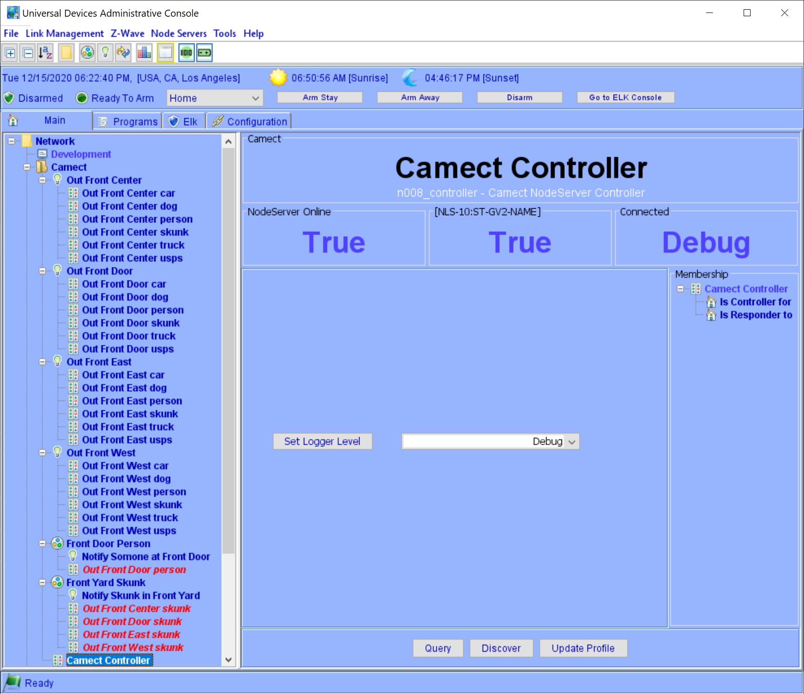
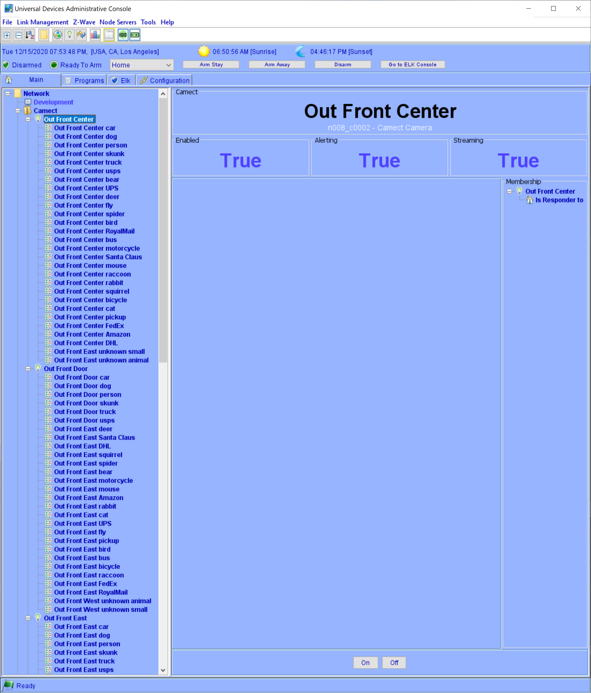
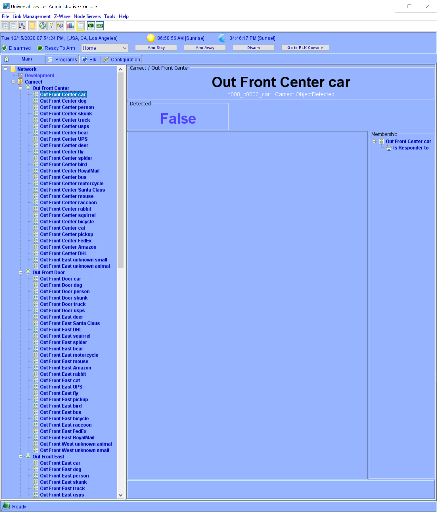
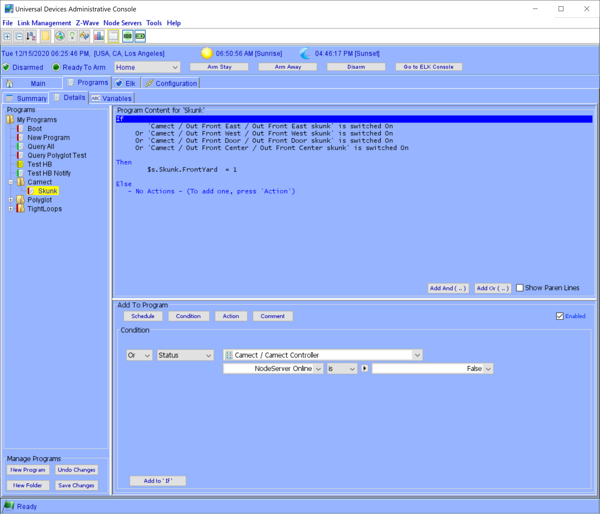
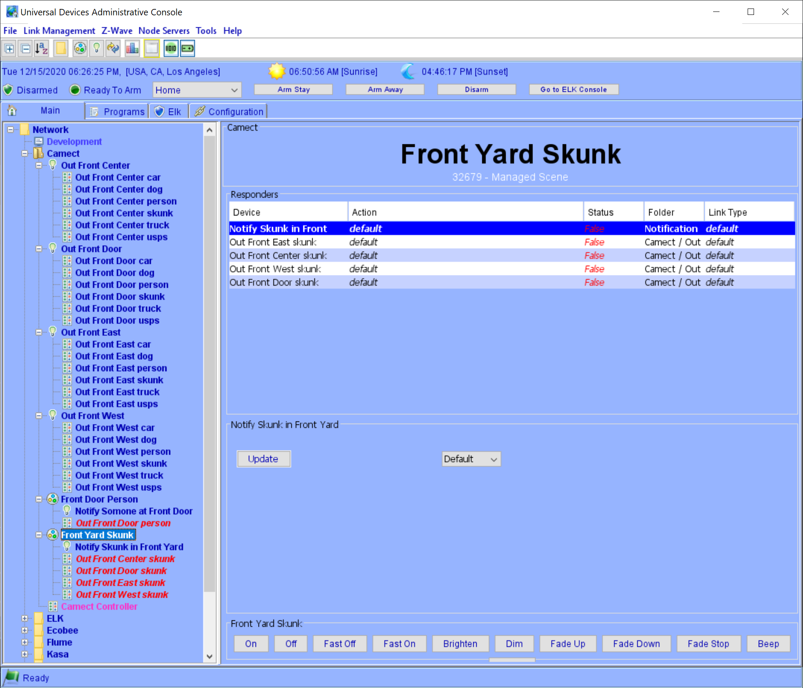

# Camect Nodeserver

This is a Polyglot Nodeserver for the [Universal Devices](https://www.universal-devices.com/) ISY to integrate the [Camect](http://camect.com) System.

This is the initial version so it may change drastically but you are welcome to test and give feedback.

## Installation

Install from the Polyglot Store.  See [Configuration](POLYGLOT_CONFIG.md) on the configuration page after installing.

## Requirements

This has been tested on an RPI running the latest Buster release and the Polisy.  You must have Python verison 3.6 or newer.

## Using this Nodeserver

After configuring you should get a Node for each Camera, and under each Camera an ObjectDetected node for each type of object currently detected by Camect.

The conroller looks like this... __Add more info here___

A node is created for each Camera... __Add more info here___

The Camera nodes all have a child node for each known detected object type by Camect.  __Add more info here__

You can create a program to know when a Skunk enters your front yard 

You can add the nodes to a scene to know when a Skunk enters the front yard 

## Version History

- 0.0.2
    - First working version
- 0.0.1
    - First release
